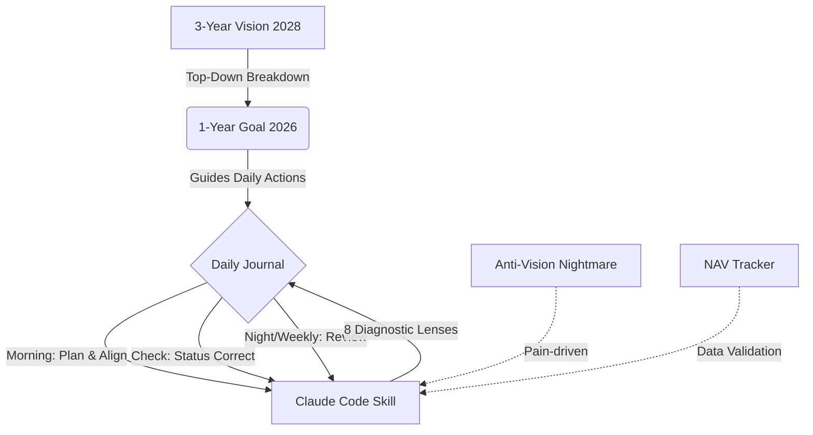

[English](README.md) | [中文](README_zh.md)

# Life Coach - Your Hardcore AI Life Coach

**Stop lying to yourself. Stop using tactical diligence to cover up strategic laziness.**

This is a No-BS goal management system run by a custom Claude Code Skill. It doesn't just break down your long-term vision; it uses harsh numbers and "Anti-Vision" to tear through your procrastination excuses, ensuring every minute you spend pushes you toward your ideal 2028 self.

**It won't tell you "You can do it". It will tell you "Go do it."**

---

## 📖 System Logic & Flywheel

Life Coach combines **top-down goal breakdown** with **negative motivation (Pain-driven)**:



### 1. Three-Tier Goal System
- **3-Year Vision (plan.md)**: Define who you want to be in 2028 - career, finance, health, relationships.
- **1-Year Plan (goal.md)**: Break down the 3-year vision into specific annual goals, quarterly targets, and daily habits.
- **Daily Journal (daily/*.md)**: Record daily intentions, happenings, gratitudes, action items, and feelings.

### 2. Anti-Vision Mechanism
Beyond positive goals, the system uses an **anti-vision** for "pain-driven" motivation:
- When procrastination, avoidance, or inefficiency is detected, the system quotes your anti-vision to remind you of the very future you're terrified of.
- This "negative reinforcement (loss aversion)" is often far more impactful than purely positive goals.

<details>
<summary>👀 View Anti-Vision (Nightmare Scenario) Template</summary>

*One morning in 2028, I wake up.*
*I am still living in this small, messy apartment. My phone is lighting up with bills I still cannot pay.*
*I look at my out-of-shape body and thinning hair in the mirror. I'm still working that easily-replaced-by-AI job, wasting my life in meaningless meetings and alignment syncs.*
*I see my peers achieving the goals I originally set for myself, and I can only comfort my incompetence by calling myself "ordinary but precious."*
</details>

> Inspired by: [How to fix your entire life in 1 day](https://x.com/thedankoe/status/2010751592346030461) by @thedankoe

### 3. 8 Precision Diagnostic Lenses
The system runs 8 harsh diagnostic lenses to automatically check and slap you back to reality during each interaction:

1. **🎯 Goal Alignment (Hierarchy Check)**: Checks if daily tasks align with annual goals.
   > *"You spent 3 hours on this task today, and it has absolutely nothing to do with your 2026 goals. Are you using busyness to mask ineffectiveness again? Delete it immediately."*
2. **🪞 Identity Audit**: Checks if your behavior matches the identity of your vision.
3. **🚧 Action Verification**: Checks for actual output, not just feeling productive.
4. **🛡️ Nightmare Wake-up (Anti-Vision Reality)**: Uses anti-vision to alert you when severe avoidance is detected.
   > *"Look at your Anti-vision: 'Still working a job you don't care about...' Every excuse you make today is pushing you into that mediocre abyss."*
5. **📉 NAV Alert**: Compares asset changes against action investment.
   > *"Your net worth is shrinking, yet you wrote 7 journals this week. Tactical diligence cannot cover up strategic incompetence."*
6. **⏳ Time Black Hole**: Detects if you're doing "fake work" (like over-optimizing tools).
7. **🔄 Weekly Review**: Generates a weekly report and provides strategic advice.
8. **📊 Data Speaks**: Verifies your effectiveness using objective numbers.

---

## 🚀 Why Life Coach?

🔐 **Absolute Data Privacy (Local-First Obsidian)**  
Your deepest desires, anxieties, financials, and diary details remain entirely stored in your local Obsidian vault. The system only reads and streams them to Claude for analysis during runtime, offering the **perfect blend of absolute privacy and AI power**.

---

## 📦 How to Install

### Prerequisites
- [Claude Code](https://github.com/anthropics/claude-code) CLI tool
- Obsidian (For the ultimate local Markdown note management experience)

### Setup Steps

1. **Clone the Project**
```bash
git clone https://github.com/y2hhbw/life_coach.git ~/projects/life-coach
```

2. **Integrate with Obsidian Vault (Recommended)**
We provide complete journaling templates. Just link them inside your Obsidian vault:
```bash
# Assuming your Obsidian vault is at ~/Documents/obsidian/my-vault
cd ~/Documents/obsidian/my-vault

# Create symbolic links (or copy the folders directly)
ln -s ~/projects/life-coach/journal ./journal
ln -s ~/projects/life-coach/templates ./templates
```

3. **Configure and Install the Skill**
Open and edit the Skill file (`SKILL_en.md` or `SKILL.md`), and update the `VAULT_ROOT` to match your actual Obsidian vault path:
```bash
# Copy the updated skill to the Claude Code skills directory
cp ~/projects/life-coach/SKILL_en.md ~/.claude/skills/life-coach.md
```

4. **Initialize Core Files**
Open Obsidian, and create your vision/goal files based on the structure:
- `journal/vision_2028/plan.md` - Define your 2028 vision
- `journal/vision_2028/anti-vision.md` - The nightmare future to avoid
- `journal/vision_2028/2026/goal.md` - 2026 annual goals

---

## ⚡ Quick Start

1. **Morning Planning**
   When starting your day, open a terminal with Claude Code loaded and run:
   ```bash
   /life-coach morning
   ```
   The system will generate today's journal based on the template and give you planning advice based on yesterday.

2. **Daytime Filling & Checking**
   - Continuously update your daily journal in Obsidian (intentions, happenings, gratitudes, action items, feelings).
   - Anytime you want AI to spot-check your status, run:
     ```bash
     /life-coach check
     ```

3. **Evening & Weekly Review**
   ```bash
   /life-coach night     # Deep daily feedback
   /life-coach weekly    # Strategic weekly report
   ```

---

## 💡 Support & Donation

If you feel this hardcore Life Coach system is altering the trajectory of your life, support the development:

<a href="https://nowpayments.io/payment/?iid=5525026308&source=button" target="_blank" rel="noreferrer noopener">
   
</a>
<a href="https://www.buymeacoffee.com/hallidayyy" target="_blank">
    
</a>

---

## 📄 License

MIT
