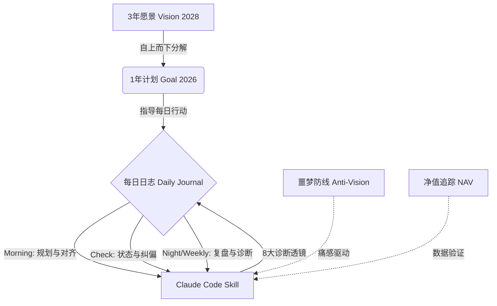

[English](README.md) | [中文](README_zh.md)

# Life Coach - 你的硬核 AI 人生教练

**不再自欺欺人。不再用战术的勤奋掩盖战略的懒惰。**

这是一个基于 Claude Code Skill 构建的无废话 (No BS) 目标管理系统。它不仅帮你拆解长期愿景，更会用严厉的数据和“反向激励（Anti-Vision）”无情地撕破你的拖延借口，确保你度过的每一分钟，都在推动你成为 2028 年那个理想的自己。

**它不会对你喊“加油”，它只会对你说“去做”。**

---

## 📖 系统逻辑与运转飞轮

Life Coach 采用**自上而下的目标分解**和**反向激励**相结合的方法论：



### 1. 三层目标体系
- **3年愿景 (plan.md)**：定义你在 2028 年想成为什么样的人，包括事业、财务、健康、关系等各方面的理想状态。
- **1年计划 (goal.md)**：将 3 年愿景分解为当年的具体目标，包括季度目标、月度指标、每日习惯。
- **每日日志 (daily/*.md)**：记录每天的意图 (intentions)、发生的事 (happenings)、感恩的事 (grateful for)、行动项 (action items) 和感受 (feelings)。

### 2. 反愿景机制 (Anti-Vision)
除了正向的目标激励，系统还使用**反愿景**来提供"痛感驱动"：
- 当检测到逃避、低效或拖延行为时，System 会引用你自己的反愿景内容，用未来的你警醒现在的你。
- 这种“负面激励（损失厌恶）”，往往比单纯的正向目标更有冲击力。

<details>
<summary>👀 查看 Anti-Vision (噩梦防线) 示例模板</summary>

*2028年的某个清早，我醒来。*
*我依然住在这个狭小杂乱的出租屋里。手机里弹出的还是还不完的账单。*
*我看着镜子里逐渐走样的身材，和日渐稀薄的头发。我还在做着那份随时可能被 AI 替代的工作，每天在无意义的会议和对齐中消耗生命。*
*我看到别人实现了我原本可以实现的目标，我只能用“平凡可贵”来安慰自己的无能。*

</details>

> 灵感来源：[How to fix your entire life in 1 day](https://x.com/thedankoe/status/2010751592346030461) by @thedankoe

### 3. 8个精准诊断工具 (Diagnostic Lenses)
系统内置了 8 个严酷的诊断视角，在每次交互时自动检查并给你反馈：

1. **🎯 目标连线 (Hierarchy Check)**：检查日常任务是否与年度目标对齐。
   > *"你今天花了 3 小时做的这个任务，和你的 2026 目标毫无关联。你是不是又在用忙碌掩盖无效？立即删除它。"*
2. **🪞 身份拷问 (Identity Audit)**：检查行为是否配得上你的愿景身份。
3. **🚧 行动验证 (Action Verification)**：检查是否有实际产出，而非自我感动。
4. **🛡️ 噩梦唤醒 (Anti-Vision Reality)**：在检测到严重拖延时，用反愿景警醒你。
   > *"看看你的 Anti-vision：'你依然在一个毫不关心的岗位上做着重复劳动...'你今天的每一次逃避，都在让你滑向那个平庸的深渊。"*
5. **📉 净值对照 (NAV Alert)**：对比资产变化与行动投入。
   > *"你的净值在缩水，但你这周写了 7 篇日志。战略上的无能，掩盖不了战术上的勤奋。"*
6. **⏳ 时间黑洞 (Time Black Hole)**：检测是否在做"伪工作"（如过度优化工具）。
7. **🔄 周复盘 (Weekly Review)**：每周生成周报并提供战略建议。
8. **📊 数据说话 (Data Speaks)**：用客观数据验证你的成效。

---

## 🚀 为什么选择 Life Coach？

🔐 **绝对的数据隐私（基于本地 Obsidian）**  
你最深层的渴望、焦虑、财务状况和日记细节，完全保存在你本地的 Obsidian 库中。系统只在运行命令时读取并发送给 Claude 进行分析，真正做到了**数据隐私安全与 AI 赋能的完美结合**。

---

## 📦 如何使用

### 前置要求
- [Claude Code](https://github.com/anthropics/claude-code) CLI 工具
- Obsidian（用于提供最好的本地 Markdown 笔记管理体验）

### 安装步骤

1. **Clone 项目到本地**
```bash
git clone https://github.com/y2hhbw/life_coach.git ~/projects/life-coach
```

2. **多语言版本选择 (Multi-language)**
默认的 `SKILL.md` 为中文教练，如果你更喜欢纯英文教练环境，请使用 `SKILL_en.md` 并使用英文模板：
- 中文版：请在下一步中复制 `SKILL.md`，并在 Obsidian 中使用 `daily_template_zh.md` 和 `weekly_template_zh.md`。
- 英文版：请在下一步中复制 `SKILL_en.md` 单独重命名为 `life-coach.md`，使用 `daily_template.md` 和 `weekly_template.md`。

3. **整合到 Obsidian 库（推荐）**
为了让系统能在你的设备上顺畅运行，最简单的做法是直接将这些日记文件夹移动/复制到你的 Obsidian 库中：

**📦 通用复制法 (所有系统均适用)：**
这是最不容易出错的方法。
- 打开你在刚才 Clone 下来的 `~/projects/life-coach` 文件夹。
- 复制里面的 `journal` 文件夹和 `templates` 文件夹。
- 打开你的 Obsidian 库对应的文件夹。
- 将它们直接粘贴到你的 Obsidian 库的根目录下。

*[可选：对于高阶玩家]*
如果你熟悉终端并且希望代码库和你的笔记库保持硬性的软链接同步，可以使用如下命令：
- **Mac / Linux:**
  ```bash
  cd /你的/Obsidian/库路径
  ln -s ~/projects/life-coach/journal ./journal
  ln -s ~/projects/life-coach/templates ./templates
  ```
- **Windows (需要使用管理员权限运行 CMD):**
  ```cmd
  cd \你的\Obsidian\库路径
  mklink /D journal "%HOMEPATH%\projects\life-coach\journal"
  mklink /D templates "%HOMEPATH%\projects\life-coach\templates"
  ```

4. **配置并安装 Skill**
打开并编辑你选择的 Skill 文件 (`SKILL.md` 或 `SKILL_en.md`)，将其中的 `VAULT_ROOT` 修改为你实际的 Obsidian 库路径：

```bash
# 修改完成后，将 skill 复制到 Claude Code skills 目录
# 如果你使用中文版：
cp ~/projects/life-coach/SKILL.md ~/.claude/skills/life-coach.md
# 如果你使用英文版：
# cp ~/projects/life-coach/SKILL_en.md ~/.claude/skills/life-coach.md
```

5. **初始化核心文件**
进入你的 Obsidian，根据模板创建自己的愿景和目标文件：
- `journal/vision_2028/plan.md` - 定义你的 2028 年愿景
- `journal/vision_2028/anti-vision.md` - 描述你想避免的未来
- `journal/vision_2028/2026/goal.md` - 设定 2026 年度目标

---

## ⚡ 快速开始

1. **早间规划**
   在新的一天开始时，在打开了 Claude Code 的终端中运行：
   ```bash
   /life-coach morning
   ```
   系统会自动创建今日日报模板，并基于昨日情况提供规划建议。

2. **日间填写与检查**
   - 在你的 Obsidian 中随时更新今日日志（意图、发生的事、感恩、行动项、感受等）。
   - 随时通过以下命令让 AI 执行状态抽查：
     ```bash
     /life-coach check
     ```

3. **晚间与周复盘**
   ```bash
   /life-coach night     # 每日晚间深度复盘反馈
   /life-coach weekly    # 每周战略总结报表
   ```

---

## 💡 Support & Donation

如果你觉得这个硬核 Life Coach 系统正在改变你的生活轨迹，欢迎支持开发：

<a href="https://nowpayments.io/payment/?iid=5525026308&source=button" target="_blank" rel="noreferrer noopener">
   
</a>
<a href="https://www.buymeacoffee.com/hallidayyy" target="_blank">
    
</a>

---

## 📄 License

MIT
