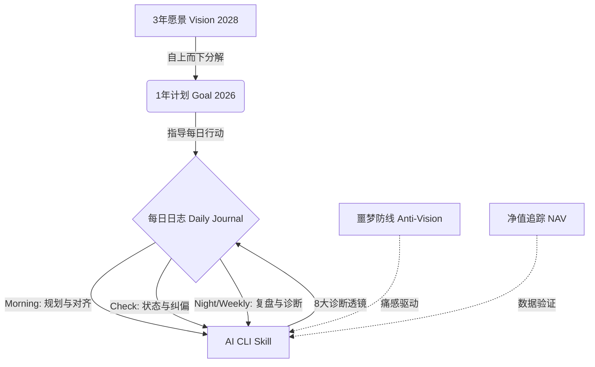

[English](README.md) | [中文](README_zh.md)

# Life Coach - 你的硬核 AI 人生教练

**不再自欺欺人。不再用战术的勤奋掩盖战略的懒惰。**

这是一个基于 AI CLI Skill 构建的无废话 (No BS) 目标管理系统。它不仅帮你拆解长期愿景，更会用严厉的数据和“反向激励（Anti-Vision）”无情地撕破你的拖延借口，确保你度过的每一分钟，都在推动你成为 2028 年那个理想的自己。

**它不会对你喊“加油”，它只会对你说“去做”。**

---

## 📖 系统逻辑与运转飞轮

Life Coach 采用**自上而下的目标分解**和**反向激励**相结合的方法论：



### 1. 三层目标体系
- **3年愿景 (plan.md)**：定义你在 2028 年想成为什么样的人，包括事业、财务、健康、关系等各方面的理想状态。
- **1年计划 (goal.md)**：将 3 年愿景分解为当年的具体目标，包括季度目标、月度指标、每日习惯。
- **每日日志 (daily/*.md)**：记录每天的意图 (intentions)、发生的事 (happenings)、感恩的事 (grateful for)、行动项 (action items) 和感受 (feelings)。

### 2. 反愿景机制 (Anti-Vision)
除了正向的目标激励，系统还使用**反愿景**来提供"痛感驱动"：
- 当检测到逃避、低效或拖延行为时，System 会引用你自己的反愿景内容，用未来的你警醒现在的你。
- 这种“负面激励（损失厌恶）”，往往比单纯的正向目标更有冲击力。

<details>
<summary>👀 查看 Anti-Vision (噩梦防线) 示例模板</summary>

*2028年的某个清早，我醒来。*
*我依然住在这个狭小杂乱的出租屋里。手机里弹出的还是还不完的账单。*
*我看着镜子里逐渐走样的身材，和日渐稀薄的头发。我还在做着那份随时可能被 AI 替代的工作，每天在无意义的会议和对齐中消耗生命。*
*我看到别人实现了我原本可以实现的目标，我只能用“平凡可贵”来安慰自己的无能。*

</details>

> 灵感来源：[How to fix your entire life in 1 day](https://x.com/thedankoe/status/2010751592346030461) by @thedankoe

### 3. 8个精准诊断工具 (Diagnostic Lenses)
系统内置了 8 个严酷的诊断视角，在每次交互时自动检查并给你反馈：

1. **🎯 目标连线 (Hierarchy Check)**：检查日常任务是否与年度目标对齐。
   > *"你今天花了 3 小时做的这个任务，和你的 2026 目标毫无关联。你是不是又在用忙碌掩盖无效？立即删除它。"*
2. **🪞 身份拷问 (Identity Audit)**：检查行为是否配得上你的愿景身份。
3. **🚧 行动验证 (Action Verification)**：检查是否有实际产出，而非自我感动。
4. **🛡️ 噩梦唤醒 (Anti-Vision Reality)**：在检测到严重拖延时，用反愿景警醒你。
   > *"看看你的 Anti-vision：'你依然在一个毫不关心的岗位上做着重复劳动...'你今天的每一次逃避，都在让你滑向那个平庸的深渊。"*
5. **📉 净值对照 (NAV Alert)**：对比资产变化与行动投入。
   > *"你的净值在缩水，但你这周写了 7 篇日志。战略上的无能，掩盖不了战术上的勤奋。"*
6. **⏳ 时间黑洞 (Time Black Hole)**：检测是否在做"伪工作"（如过度优化工具）。
7. **🔄 周复盘 (Weekly Review)**：每周生成周报并提供战略建议。
8. **📊 数据说话 (Data Speaks)**：用客观数据验证你的成效。

---

## 🚀 为什么选择 Life Coach？

🔐 **本地优先的数据隐私（基于 Obsidian）**  
你最深层的渴望、焦虑、财务状况和日记细节都保存在本地 Obsidian 库中。系统仅在执行命令时，将相关内容发送到你配置的 AI 模型 API 进行分析，文件本身仍保留在本地 Vault。

### 默认安全策略
- 安装器默认使用非覆盖复制模式（不会覆盖已有文件）。
- 若 `journal/vision_2028/2026/goal.md` 不存在，安装器会按语言模板自动创建。
- 安装器会创建干净的日志目录结构，不会导入示例日报/周报历史数据。
- 你已有的日志历史会被保留。

---

## 📦 如何使用

### 前置要求
- 以下任意一款 AI CLI 工具：
  - [Claude Code](https://github.com/anthropics/claude-code)
  - Codex
  - Qwen
  - Opencode
- Obsidian（用于提供最好的本地 Markdown 笔记管理体验）

### 安装步骤

1. **Clone 项目到本地**
```bash
git clone https://github.com/y2hhbw/life_coach.git ~/projects/life-coach
cd ~/projects/life-coach
```

2. **运行交互式安装脚本**
最简单的安装和配置方式是运行交互式安装脚本。它会以非覆盖模式复制所需模板和日志文件夹到你的 Obsidian 库中，并为你选择的 AI 助手配置 Skill。

- **Mac / Linux:**
  ```bash
  chmod +x install.sh
  ./install.sh
  ```
- **Windows (PowerShell):**
  ```powershell
  .\install.ps1
  ```

*请按照屏幕上的提示选择你的语言、选择你的 AI 助手，并提供你的 Obsidian 库的绝对路径。*

3. **初始化核心文件**
进入你的 Obsidian，完善以下文件内容：
- `journal/vision_2028/plan.md` - 定义你的 2028 年愿景
- `journal/vision_2028/anti-vision.md` - 描述你想避免的未来
- `journal/vision_2028/2026/goal.md` - 设定 2026 年度目标（若不存在，安装器会按语言模板自动创建）

4. **确认目录结构**
安装后，你的 Vault 应至少包含：
```text
journal/
  vision_2028/
    plan.md
    anti-vision.md
    2026/
      goal.md
  daily/
    YYYY/MM/YYYY-MM-DD.md
  weekly/
templates/
  daily_template.md
  weekly_template.md
  goal_template.md
```

---

## ⚡ 快速开始

1. **早间规划**
   在新的一天开始时，在打开了你选择的 AI 助手的终端中运行：
   ```bash
   /life-coach morning
   ```
   系统会自动创建今日日报模板，并基于昨日情况提供规划建议。

2. **日间填写与检查**
   - 在你的 Obsidian 中随时更新今日日志（意图、发生的事、感恩、行动项、感受等）。
   - 随时通过以下命令让 AI 执行状态抽查：
     ```bash
     /life-coach check
     ```

3. **晚间与周复盘**
   ```bash
   /life-coach night     # 每日晚间深度复盘反馈
   /life-coach weekly    # 每周战略总结报表
   ```

## 🧭 多助手命令触发方式

- 推荐方式：直接调用并附带模式，例如 `/life-coach morning`
- 如果你的助手不支持“斜杠命令 + 参数”单行触发：
  - 先调用技能：`/life-coach`
  - 再在下一条消息发送模式关键词：`morning` / `check` / `night` / `weekly`

---

## 🛠️ 故障排查

- **`Core file missing: goal.md`**  
  请确认你的 Obsidian Vault 中存在 `journal/vision_2028/2026/goal.md`。

- **`No journal created today`**  
  先执行 `/life-coach morning`，再使用 `/life-coach check` 或 `/life-coach night`。

- **AI CLI 中找不到 Skill**  
  重新运行安装脚本，并确认你选择了正确的助手（`Claude Code` / `Codex` / `Qwen` / `Opencode`）。

- **不同助手的斜杠命令行为不同**  
  先执行 `/life-coach`，再发送 `morning` / `check` / `night` / `weekly`。

- **模板未按预期生效**  
  使用安装脚本的绝对路径重新执行，并确认语言选择正确。

---

## 💡 Support & Donation

如果你觉得这个硬核 Life Coach 系统正在改变你的生活轨迹，欢迎支持开发：

<a href="https://nowpayments.io/payment/?iid=5525026308&source=button" target="_blank" rel="noreferrer noopener">
   
</a>
<a href="https://www.buymeacoffee.com/hallidayyy" target="_blank">
    
</a>

---

## 📄 License

[MIT](LICENSE)
